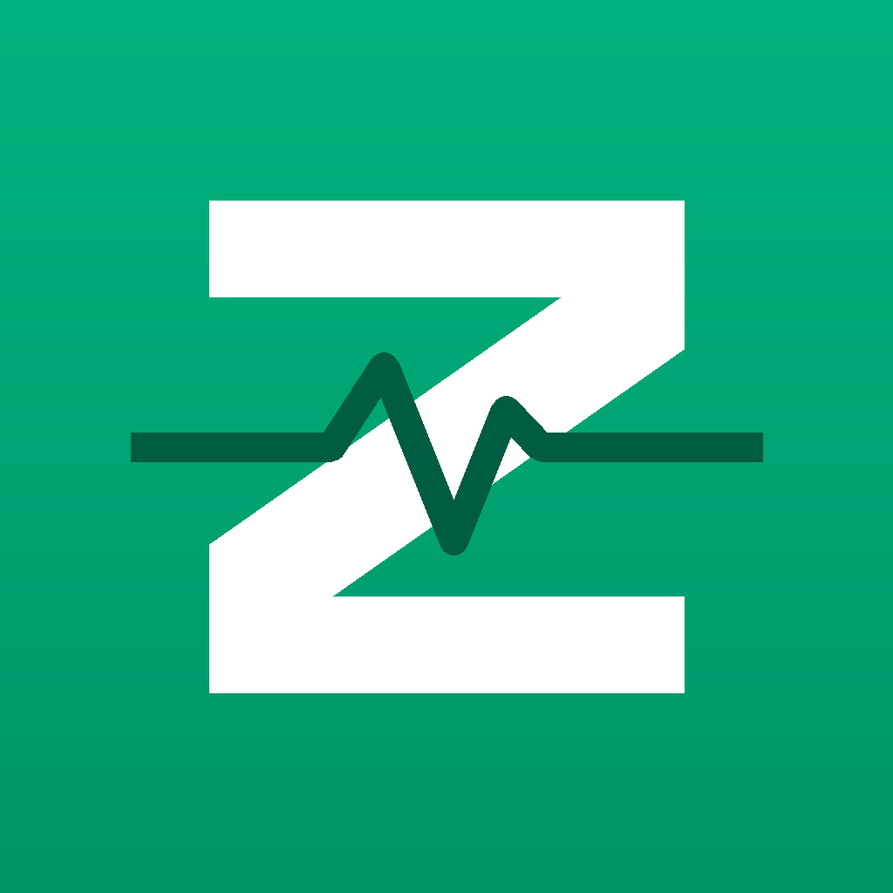
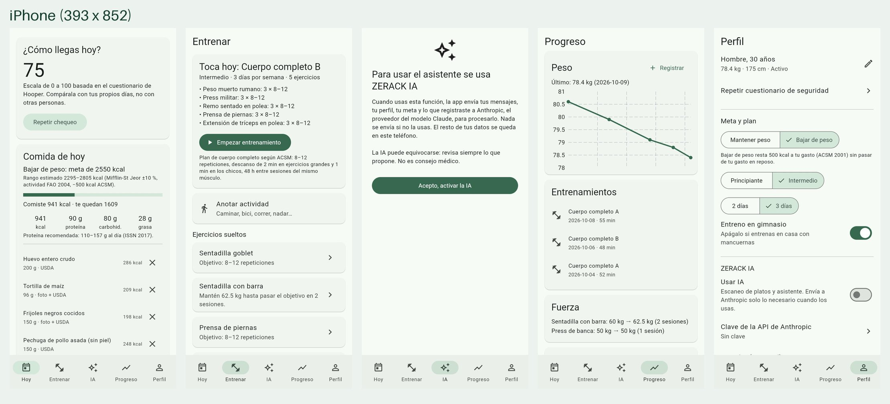
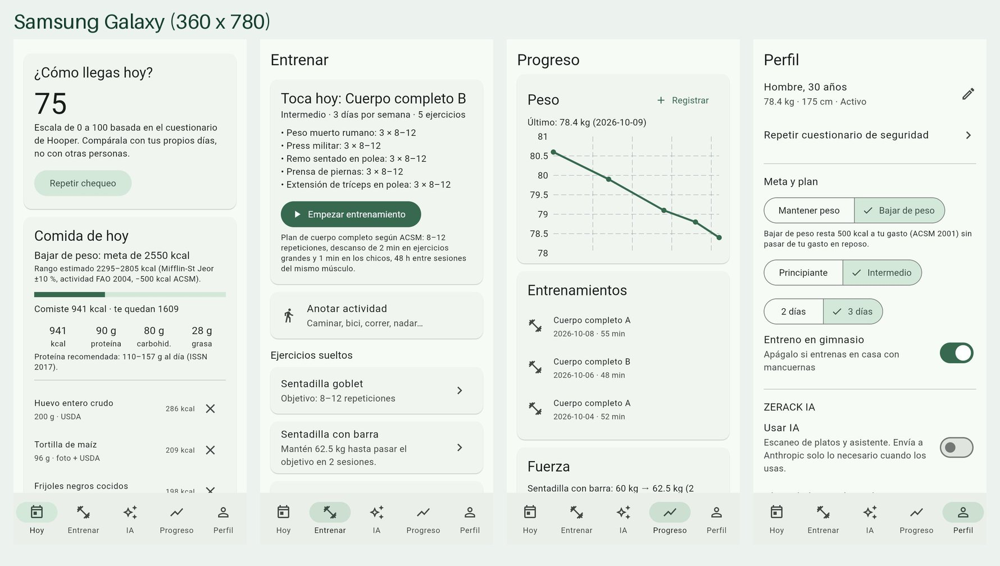

<p align="center"></p>

# ZERACK Fit

Entrenamiento y nutrición que se adaptan a ti. Open source, **local-first** (tus
datos se quedan en tu teléfono) y con **cada regla respaldada por una fuente
publicada**.

> ZERACK es una herramienta de entrenamiento y bienestar. **No diagnostica ni
> trata enfermedades** y no sustituye a un profesional de la salud. Si sientes
> dolor en el pecho, mareo o falta de aire anormal, detente y busca atención.

**Pruébala ya:** https://itzjk.github.io/zerack-fit/ (en iPhone ábrela en Safari →
Compartir → "Agregar a inicio"). APK de Android en
[Releases](https://github.com/itzjk/zerack-fit/releases).




## Qué hace

**Hoy**
- Chequeo diario de 4 preguntas con nota de 0 a 100 (índice de Hooper).
- Meta de energía personal (Mifflin-St Jeor + actividad FAO, −500 kcal si
  quieres bajar de peso) y proteína recomendada según tu peso.
- Comidas con calorías y macros: **escanea tu plato con IA**, busca entre 168
  alimentos del USDA, lee el código de barras (Open Food Facts) o anota a mano.
- Pulso en reposo con el dedo sobre la cámara (beta).
- Actividad de los últimos 7 días contra la recomendación de la OMS.

**Entrenar**
- Cuestionario de seguridad ACSM al entrar: si pide autorización médica,
  Entrenar queda bloqueado hasta confirmarla.
- Plan de cuerpo completo A/B (ACSM): series, repeticiones, descansos.
- Sesión guiada con temporizador de descanso y sugerencia de peso (sube 2–10 %
  cuando superas el objetivo dos sesiones seguidas).
- Botón **"Me siento mal"** que detiene la sesión ante signos de alarma.

**ZERACK IA** (opcional)
- Asistente que conoce tu perfil, tu meta y lo que comiste; propone comidas y
  tú confirmas. Ver [docs/IA.md](docs/IA.md).

**Progreso**: peso con gráfica, entrenos, fuerza y pulso.

**Perfil**: meta y plan, IA, Apple Health / Health Connect, respaldo,
privacidad y fuentes.

## Principios

1. **Sin fuente no hay regla.** Ver [SOURCES.md](SOURCES.md).
2. **Local-first:** sin cuenta ni servidor propio.
3. **La IA identifica, el USDA cuenta:** la IA nunca inventa calorías.
4. **Estimar, no diagnosticar.**
5. **Ante la duda, lo seguro.**

## Estructura

```
packages/zerack_core   Motor en Dart puro: fórmulas, reglas y pruebas
apps/zerack_fit        App Flutter (iPhone, Android, web para pruebas)
tools/foods            Generador de la base de alimentos desde el USDA
tools/icon             Generador del ícono
docs/                  IA, plan, revisión
```

## Desarrollo

```bash
cd packages/zerack_core && dart pub get && dart test
cd apps/zerack_fit && flutter pub get && flutter test
flutter run                   # iPhone (requiere Xcode) o Android
flutter run -d chrome         # web, para probar rápido
flutter build apk --release   # APK de Android
```

Contribuir: [CONTRIBUTING.md](CONTRIBUTING.md). Cambios: [CHANGELOG.md](CHANGELOG.md).

## Licencia

[MIT](LICENSE) © ZERACK. Datos de alimentos: USDA FoodData Central (dominio
público). Productos empacados: Open Food Facts (ODbL).
